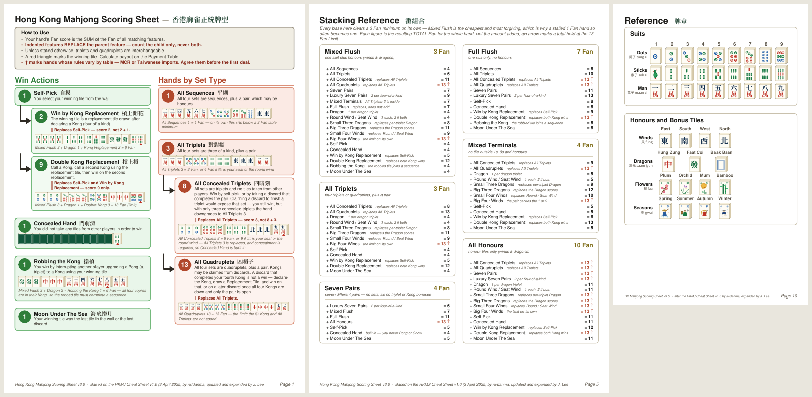

# Hong Kong Mahjong Scoring Sheet

A print-ready scoring reference for Hong Kong Mahjong, generated from a single
source of truth. Every hand carries its Fan value, a Chinese name, a tile
example drawn as artwork rather than a font glyph, and a worked Fan breakdown.



## What you get

| File | Pages | What it is |
|---|---|---|
| `pdf/HK-Mahjong-Scoring-Sheet-v3.pdf` | 5 | The full sheet — hands, reference, stacking |
| `pdf/HK-Mahjong-Stacking-Reference.pdf` | 1 | The stacking page on its own |
| `pdf/HK-Mahjong-Booklet-reading-order.pdf` | 16 | Half-letter booklet panels, in sequence, for proofing |
| `pdf/HK-Mahjong-Booklet-print-fold.pdf` | 8 | The same panels imposed two-up for saddle-stitch printing |
| `pdf/HK-Mahjong-Booklet-print-fold-ALT.pdf` | 8 | Same, reverse sides pre-rotated for the other duplex setting |
| `web/index.html` | — | Self-contained HTML version, tiles rendered in CSS 3D |

### Printing the booklet

Print `print-fold` **two-sided, flip on short edge, at 100% scale** on US Letter.
Stack the four sheets, fold the pile once down the middle, staple twice on the
spine. If the reverse sides come out upside down, print the `ALT` file with the
same settings instead.

## Building from source

Requirements:

- Python 3.8+
- [ReportLab](https://pypi.org/project/reportlab/), [fontTools](https://pypi.org/project/fonttools/), [pypdf](https://pypi.org/project/pypdf/) — `pip install -r requirements.txt`
- ImageMagick, for the `convert` binary that rasterises tile SVGs
- Noto Serif CJK and Noto Sans CJK

```sh
# Debian / Ubuntu
sudo apt install imagemagick fonts-noto-cjk

# macOS
brew install imagemagick
brew install --cask font-noto-serif-cjk font-noto-sans-cjk
```

The CJK fonts are looked up on the usual system paths. If yours live elsewhere,
point at them directly:

```sh
export HKMJ_CJK_SERIF=/path/to/NotoSerifCJK-Bold.ttc
export HKMJ_CJK_SANS=/path/to/NotoSansCJK-Regular.ttc
```

Then:

```sh
cd src
python3 letter.py      # the 5-page sheet, readable and compact variants
python3 stackbases.py  # the standalone stacking reference
python3 booklet.py     # the 16-panel booklet, reading order
python3 -c "import booklet; booklet.impose('HKMJ-Booklet-reading.pdf', 'print.pdf')"
```

First run writes `cjkb.ttf` / `cjkr.ttf` (CJK subsets containing only the
characters the sheet uses) and populates `tilecache/` with rasterised tiles.
Both are generated artefacts and are gitignored.

## Layout

```
src/
  data.py         all sheet content — hands, Fan values, tile examples, notes
  sheet.py        layout engine: pagination, cards, mixed Latin/CJK text
  tileart.py      mahjong tile artwork as isometric SVG, cached as PNG
  mkfont.py       builds CJK font subsets that ReportLab can embed
  letter.py       builds the two Letter-size sheet variants
  stackdata.py    stacking arithmetic, derived from data.py so it cannot drift
  stackbases.py   renders the stacking page
  booklet.py      half-letter booklet and saddle-stitch imposition
  verify*.py      Fan audit: recomputes every breakdown against the tile examples
  audit_stack.py  structural audit: proves every stacking row is a possible hand
```

`data.py` is the only file to edit for content changes. Everything else derives
from it, including the stacking page, so the two documents cannot disagree.

## Verification

Two checkers run against the generated output rather than the source, so a
layout change cannot quietly break the arithmetic.

```sh
python3 verify3.py     # every Fan breakdown adds up and matches its tile example
python3 audit_stack.py # every stacking row has a legal 14-tile witness hand
```

`audit_stack.py` enumerates every legal hand shape over one suit plus the seven
honours — roughly 1.9 million hands including kong and seven-pair forms — and
requires a concrete witness for each printed row. It is what caught the
impossible combinations: honour bonuses stacked on Seven Pairs, which has no
triplets to score them on, and Robbing the Kong on hands with no sequence for
the robbed tile to complete.

## Attribution

Fan values and structure follow the **HKMJ Cheat Sheet v1.0** (3 April 2025) by
[/u/danma](https://www.reddit.com/user/danma/). Six hands marked † in the sheet
are added here, with values from MCR (Chinese Official) or Taiwanese play. Tile
artwork, Fan breakdowns, layout and notes are original to this project.

Hong Kong Mahjong scoring varies by table. Treat this as a starting point to
agree on, not an authority — the sheet says as much on its first page.

## Licence

Code and layout: MIT, see [LICENSE](LICENSE).

The generated `cjkb.ttf` / `cjkr.ttf` are subsets of Noto CJK, which is licensed
under the [SIL Open Font License 1.1](https://github.com/notofonts/noto-cjk/blob/main/Serif/LICENSE).
They are built locally and not redistributed here.
